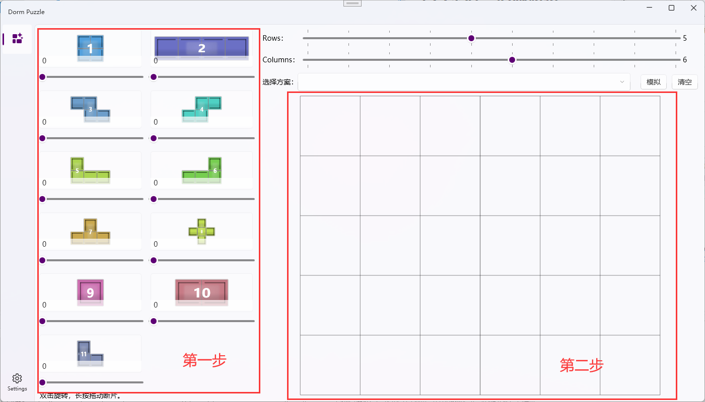
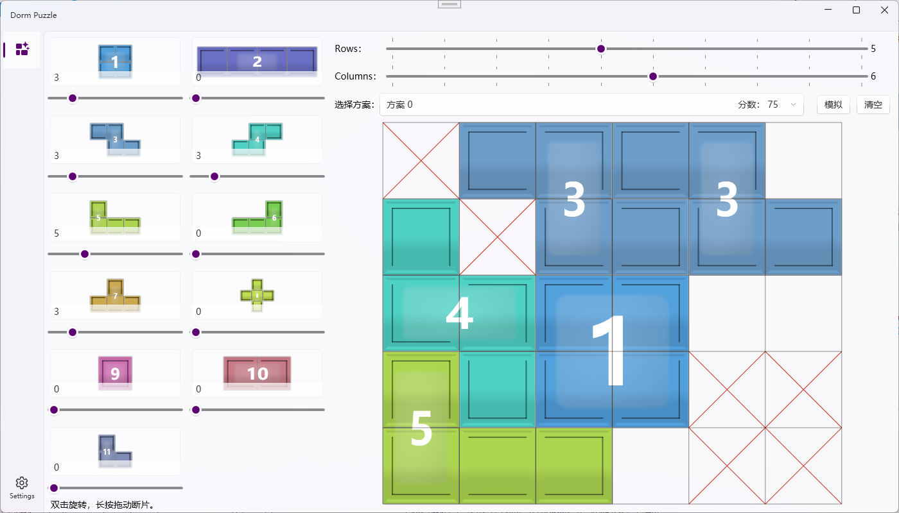
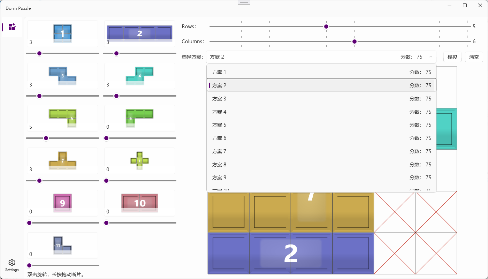

# 尘白禁区 - 信源研析

## 1. 项目简介
本项目基于 .NET 8.0 和 WPF 开发，是一款一键模拟宿舍拼图并给出最佳方案的工具。

## 2. 使用说明
1、通过滑块调整方块数量。  
2、点击网格可进行禁用操作，再次点击可启用。  
3、点击 “模拟” 按钮，等待计算完成。  

Tips: 模拟完成后，会自动选择最佳方案，也可以在下拉列表中选择其他方案。

## 3. 功能
- [x] 一键模拟宿舍拼图。
- [x] 深色主题。
- [ ] 玩法复刻。

## 4. 程序截图

## 5. 作者

Made with [contrib.rocks](https://contrib.rocks).
